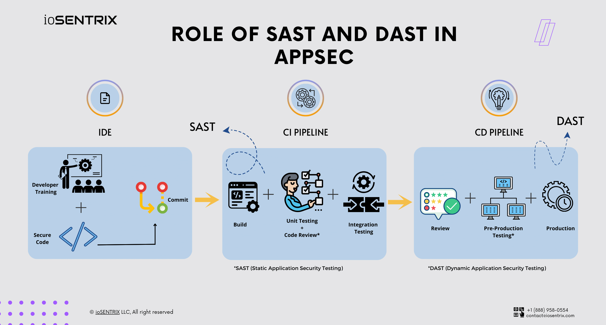
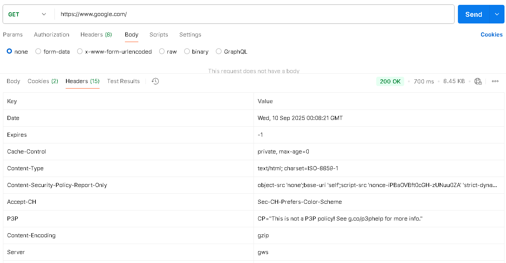
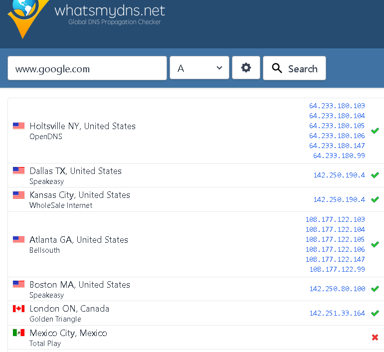
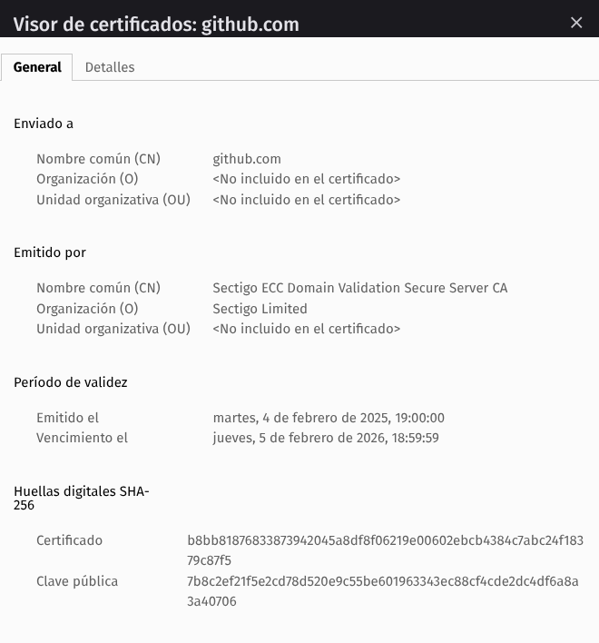
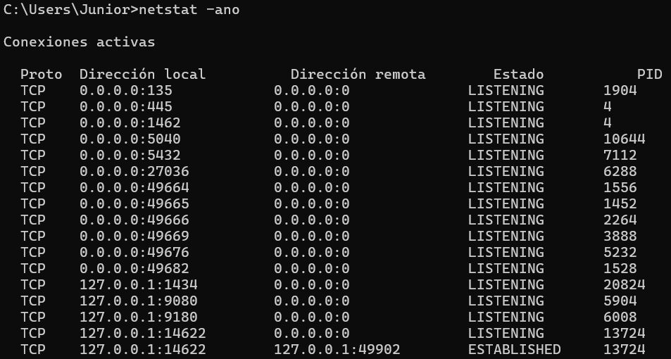

# Actividad 1: Introducción DevOps / DevSecOps
**Autor:** Ortega Turpo Junior  
**Fecha:** 09/09/2025  
**Tiempo total invertido:** 3.5h

**Entorno usado:**
Windows 11, navegador Firefox, DevTools para HTTP/TLS.

## 4.1 DevOps vs. cascada tradicional

 
- **DevOps** 
  - Feedback continuo, integración y pruebas cercanas al código en CI/CD.
  - Lanzamientos frecuentes y de bajo tamaño, facilitando reversión rápida y menor impacto.
  - Reducción de riesgo por detección temprana y promoción gradual.  
- **Cascada** 
  - Integración y validación tardías, acumulando defectos y retrabajos.
  - Lotes grandes y largos tiempos de espera entre fases, elevando la incertidumbre.

**Fuente(s):** `FUENTES.md`.

#### 4.2 Ciclo tradicional de dos pasos y silos

- **Grandes lotes**
  - **Acumulación de cambios:** cuando se juntan semanas o meses de trabajo, cada release se transforma en un paquete voluminoso y difícil de manejar.
  - **Handoffs costosos:** los traspasos entre equipos se encarecen porque el código se desalineó del estado real de producción, demandando pruebas extra y resolución de conflictos.
  - **Integración tardía = riesgo creciente:** mientras más se posterga integrar, más sube el costo; los defectos emergen cuando ya existen múltiples dependencias, amplificando el impacto.

- **Colas de defectos**
  - **Acumulación en backlog:** Los errores se apilan como tickets en lugar de corregirse en el mismo flujo donde nacen.
  - **Handoffs costosos:** Desarrollo pierde contexto con el tiempo y operación solo percibe síntomas en producción, dificultando el diagnóstico.

- **Pregunta retadora:**
  - **Throw over the wall:** es la principal caracteristica del modo tradicional, los equipos estan serparados , terminan su trabajo pero luego simplemente lo lanzan al siguiente equipo.Esto agrava los incidentes porque aumenta el **MTTR** al no entender operaciones el diseño, genera retrabajos por falta de información y provoca que se repitan las mismas degradaciones al no existir retroalimentación hacia desarrollo.  
  - **Seguridad como auditoría tardía:** Ocurre cuando el equipo de seguridad revisa solo al final. Esto agrava los incidentes porque las vulnerabilidades se detectan demasiado tarde, lo que genera retrabajo en cadena y peor aun, si algo se omite, provoca fallos recurrentes si las correcciones no se incorporan temprano en el ciclo de desarrollo.

#### 4.3 Principios y beneficios de DevOps
- **Integración Continua:** se hace cambios pequeños y frecuentes al repositorio principal, con pruebas automatizadas y de esta manera permite detectar errores rapido.

- **Entrega/Despliegue Continuo:** Los cambios validados en CI se promueven automaticamente a entornos superiores si pasan las pruebas, el tamaño reducido de los cambios facilita reversion y disminuye riesgo.

- **Colaboración:** Requiere coordinacion entre Dev y Ops, ya que los despliegues son frecuentes y deben monitorearse de inmediato.

- **Practica Agil:**
Practicas Agile, como Reuniones Diarias alimentan el pipeline CI/CD. Las diarias identifican con antelación cuellos de botella, priorizando que cambios promover o bloquear.

- **Indicador que mide la mejora de la colaboracion Devops**
  - Tiempo desde el pull request listo hasta despliegues de prueba. Ya que refleja que tan coordinados estan Dev y Ops.

#### 4.4 Evolución a DevSecOps

- **SAST:**
  - Análisis estático.
  - Se ubica temprano en el pipeline, cerca de CI.
  - Permite detectar vulnerabilidades de forma anticipada. 

- **DAST:**
  - Análisis dinámico.
  - Se ubica en staging, cuando la app ya corre en un entorno real.
  - Ataca endpoints reales.

- **Gate mínimo de seguridad:**
  - **Umbral 1:** Se requiere 0 vulnerabilidades críticas o de alta severidad (CVSS ≥ 7.0) detectadas por SAST durante la integración continua.
  - **Umbral 2:** Cobertura minima de pruebas de seguridad del 85% en SAST/DAST

- **Politica de excepción:**
  - **Condición:** Hallazgos no criticos pueden exceptuar con aprobación del equipo de seguridad
  - **Responsable:** Lider de seguirdad asignado
  - **Caducidad:** 30 dias máximo
  - **Plan de recolección:** Documentar solución en ticket con fecha limite

#### 4.5 CI/CD y estrategias de despliegue

Permite exponer la nueva versión solo a un pequeño porcentaje de usuarios al inicio, si se detecta un fallo, el impacto se limita y se puede revertir rápidamente, es ideal para servicios de misión crítica donde la indisponibilidad total no es aceptable, facilita pruebas en condiciones reales de tráfico sin comprometer toda la base de usuarios.

**Tabla de riesgos vs mitigaciones:**

| Riesgo                              | Mitigación concreta                                               |
|------------------------------------|-------------------------------------------------------------------|
| Regresión funcional                 | **Contratos de API** y tests de compatibilidad antes de promover |
| Coste de infraestructura temporal   |  	Establecer límites de tiempo en que conviven versiones.      |
| Manejo de sesión/esquema           |  	Uso de draining de conexiones y compatibilidad de esquemas de sesión.   |

Aunque los KPIs técnicos cumplan, una caída en métricas de producto exige reconsiderar la decisión, porque puede haber frustración de usuarios aun sin fallas técnicas. 
- Si los indicadores técnicos están verdes pero baja una métrica de negocio, es necesario revaluar el despliegue.
- Métricas de producto como la tasa de cancelación de compra muestran el impacto real en el negocio y la experiencia, más allá de la ausencia de errores 5xx o buena latencia.
- Por ello, los gates deben combinar KPIs técnicos y señales de producto para evitar degradaciones invisibles al plano técnico pero visibles para el usuario y el resultado financiero.

#### 4.6 Fundamentos prácticos sin comandos

- **HTTP - contrato observable**

  - Método: GET
  - Código de estado: 200 OK

- **DNS - nombres y TTL**

  - **TTL:** duración de la caché de resolución de una IP en el cliente o resolver antes de una nueva consulta.
  - **TTL alto:** propagación lenta ante cambios de IP, con posibles periodos donde conviven respuestas antiguas y nuevas.
  - **TTL bajo:** permite reversiones y cambios rápidos, pero incrementa el volumen de consultas DNS hacia los resolvers.

- **TLS - seguridad en tránsito**

  - CN/SAN: github.com
  - Vigencia: desde 4 de febrero de 2025 hasta 5 de febrero de 2026
  - Emisora: Sectigo ECC Domain Validation Secure Server CA
- **Puertos - estado de runtime**

  - **Puerto ausente:** Indica que el servicio no se expuso o no inició correctamente, señal de despliegue incompleto.
  - **Puerto en uso por tercero:** Si un puerto ya está ocupado por otro proceso puede causar conflictos al intentar iniciar un nuevo servicio en ese mismo puerto.
- **12-Factor - port binding, configuración, logs**

  - **Port binding:** La aplicación toma el puerto desde una variable de entorno en lugar de estar fijado en el código. Esto permite cambiar el puerto según el entorno sin recompilar.

  - **Logs:** Se deben enviar a stdout/stderr para que un sistema centralizado los gestione; no conviene escribirlos en archivos locales rotados a mano porque se pierde trazabilidad y escalabilidad.

  - **Anti-patrón:** Guardar credenciales en el código fuente. Esto dificulta la reproducibilidad, incrementa riesgo de exposición y obliga a modificar el código para cada entorno.

- **Checklist de diagnóstico**

| Paso | Objetivo | Evidencia esperada | Interpretación | Acción siguiente |
| --- | --- | --- | --- | --- |
| 1 | HTTP | Código 2xx/4xx/5xx + 2 cabeceras clave | Si el código no es 200 o faltan cabeceras, el API/endpoint no responde correctamente | Revisar servicio backend y endpoints; reiniciar si es necesario |
| 2 | DNS | Tipo A/CNAME y TTL | TTL alto → propagación lenta, usuarios con IP antigua | Si TTL alto y cambios recientes, esperar ventana y/o forzar ruta alternativa |
| 3 | TLS | Cert caducado o cadena incompleta | Falla de confianza | Renovar/reconfigurar certificado |
| 4 | Puertos | Puerto del servicio en LISTEN | Puerto cerrado → despliegue incompleto; ocupado → conflicto | Corregir binding o liberar puerto |
| 5 | Logs | Entradas de requests y errores en `stdout`/`stderr` | Ausencia de logs indica fallo de trazabilidad o error de despliegue | Revisar configuración de logging y flujo de salida; corregir |
| 6 | Confirmar cabeceras y caché | Cabeceras `Cache-Control` y trazabilidad presentes | Cabeceras incorrectas afectan latencia y observabilidad | Ajustar cabeceras en servidor o proxy; volver a probar HTTP |

