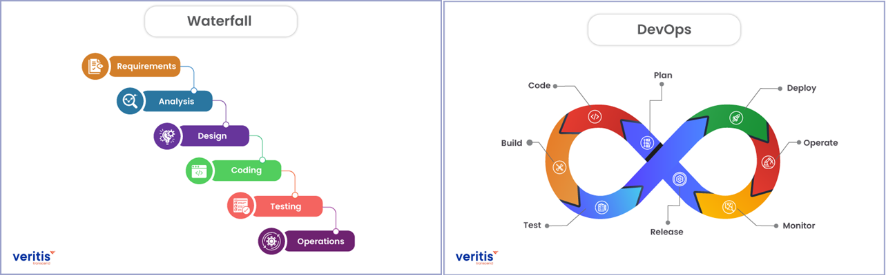

# Actividad 1: Introducción DevOps / DevSecOps
**Autor:** Ortega Turpo Junior  
**Fecha:** 09/09/2025  
**Tiempo total invertido:** 3.5h

**Entorno usado:**
Windows 11, navegador Firefox, DevTools para HTTP/TLS.

## 4.1 DevOps vs. cascada tradicional

 
- **DevOps** 
  - Feedback continuo, integración y pruebas cercanas al código en CI/CD.
  - Lanzamientos frecuentes y de bajo tamaño, facilitando reversión rápida y menor impacto.
  - Reducción de riesgo por detección temprana y promoción gradual.  
- **Cascada** 
  - Integración y validación tardías, acumulando defectos y retrabajos.
  - Lotes grandes y largos tiempos de espera entre fases, elevando la incertidumbre.

**Fuente(s):** `FUENTES.md`.

#### 4.2 Ciclo tradicional de dos pasos y silos

- **Grandes lotes**
  - **Acumulación de cambios:** cuando se juntan semanas o meses de trabajo, cada release se transforma en un paquete voluminoso y difícil de manejar.
  - **Handoffs costosos:** los traspasos entre equipos se encarecen porque el código se desalineó del estado real de producción, demandando pruebas extra y resolución de conflictos.
  - **Integración tardía = riesgo creciente:** mientras más se posterga integrar, más sube el costo; los defectos emergen cuando ya existen múltiples dependencias, amplificando el impacto.

- **Colas de defectos**
  - **Acumulación en backlog:** Los errores se apilan como tickets en lugar de corregirse en el mismo flujo donde nacen.
  - **Handoffs costosos:** Desarrollo pierde contexto con el tiempo y operación solo percibe síntomas en producción, dificultando el diagnóstico.

- **Pregunta retadora:**
  - **Throw over the wall:** es la principal caracteristica del modo tradicional, los equipos estan serparados , terminan su trabajo pero luego simplemente lo lanzan al siguiente equipo.Esto agrava los incidentes porque aumenta el **MTTR** al no entender operaciones el diseño, genera retrabajos por falta de información y provoca que se repitan las mismas degradaciones al no existir retroalimentación hacia desarrollo.  
  - **Seguridad como auditoría tardía:** Ocurre cuando el equipo de seguridad revisa solo al final. Esto agrava los incidentes porque las vulnerabilidades se detectan demasiado tarde, lo que genera retrabajo en cadena y peor aun, si algo se omite, provoca fallos recurrentes si las correcciones no se incorporan temprano en el ciclo de desarrollo.

#### 4.3 Principios y beneficios de DevOps
- **Integración Continua:** se hace cambios pequeños y frecuentes al repositorio principal, con pruebas automatizadas y de esta manera permite detectar errores rapido.

- **Entrega/Despliegue Continuo:** Los cambios validados en CI se promueven automaticamente a entornos superiores si pasan las pruebas, el tamaño reducido de los cambios facilita reversion y disminuye riesgo.

- **Colaboración:** Requiere coordinacion entre Dev y Ops, ya que los despliegues son frecuentes y deben monitorearse de inmediato.

- **Practica Agil:**
Practicas Agile, como Reuniones Diarias alimentan el pipeline CI/CD. Las diarias identifican con antelación cuellos de botella, priorizando que cambios promover o bloquear.

- **Indicador que mide la mejora de la colaboracion Devops**
  - Tiempo desde el pull request listo hasta despliegues de prueba. Ya que refleja que tan coordinados estan Dev y Ops.

#### 4.4 Evolución a DevSecOps

