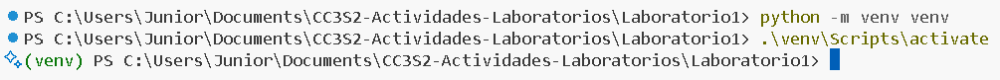
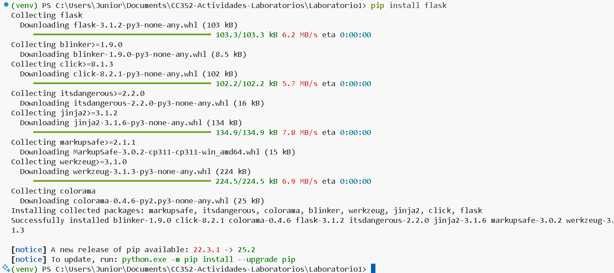
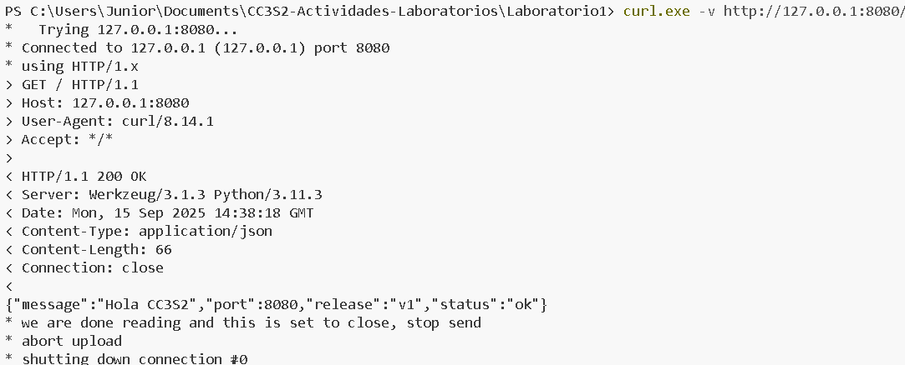
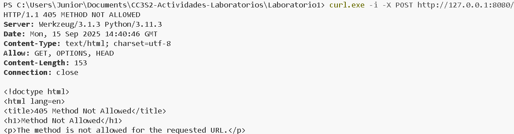
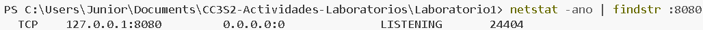
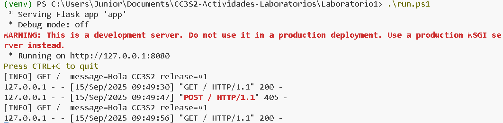

### Actividades y evidencias

#### 1) HTTP: Fundamentos y herramientas

1. **Levanta la app** con variables de entorno (12-Factor):
   `PORT=8080 MESSAGE="Hola CC3S2" RELEASE="v1" python3 app.py` (usa tu *venv*). La app **escucha** en el puerto indicado y **loggea en stdout**. Incluye extracto de salida (stdout) en el reporte. Ahora activamos el entorno virtual:
   
   Instalamos la libreria flask:
   

2. **Inspección con `curl`:**
   - `curl -v http://127.0.0.1:8080/` (cabeceras, código de estado, cuerpo JSON).
   

   - `curl -i -X POST http://127.0.0.1:8080/` (explica qué ocurre si no hay ruta/método).
   

3. **Puertos abiertos con `ss`:**
   `ss -ltnp | grep :8080` (evidencia del proceso y socket).
   

4. **Logs como flujo:** Demuestra que los logs salen por stdout (pega 2–3 líneas). Explica por qué **no** se escriben en archivo (12-Factor).
    